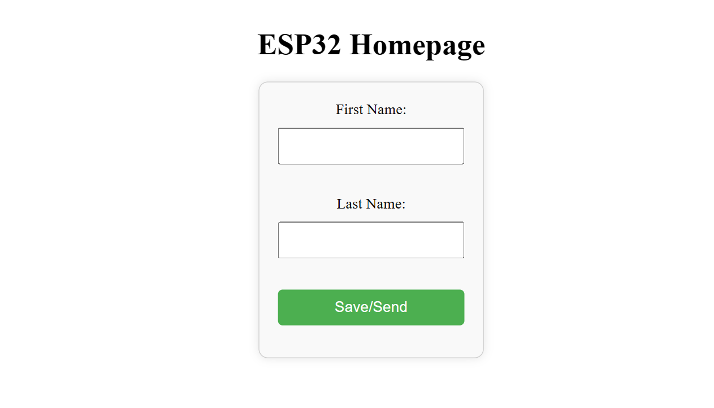

# ESP32 Web Server Example

### Description

This Repo is just a very basic example of an HTTP server, implemented using ESP-IDF. You can use it as the base to create your projects.

### Requirments

You only need an ESP32 Dev kit

### Dependencies

- cJSON: https://github.com/DaveGamble/cJSON

---

### Code Explanation

Write code that runs on ESP32 using ESP-IDF C.

The ESP runs and starts AP mode, with static IP configuration (192.168.0.1), then it starts an HTTP server on the default port (80).

### Webpage:

- It is accessed via "http://192.168.0.1/" and its UI is very simple, as a demo, it has:
  - 2 input fields: First Name, and Last Name;
  - A button (Save/Send): Performs an HTTP POST request of JSON content

So, The firmware is capable of handling 2 HTTP requests (GET and POST).
